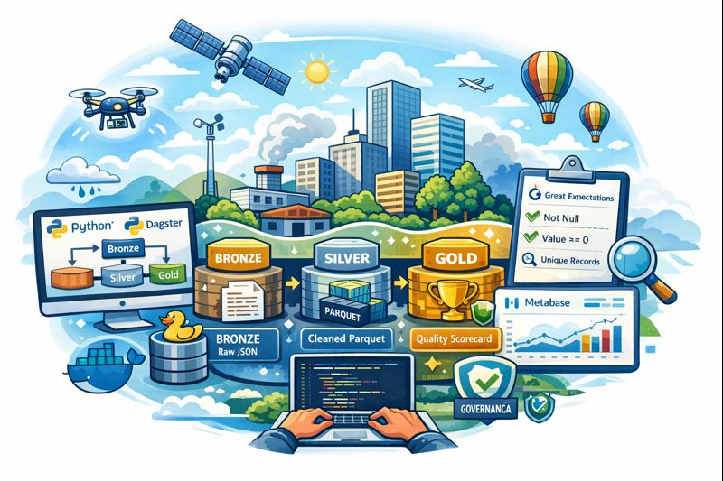
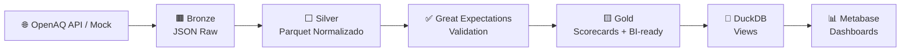
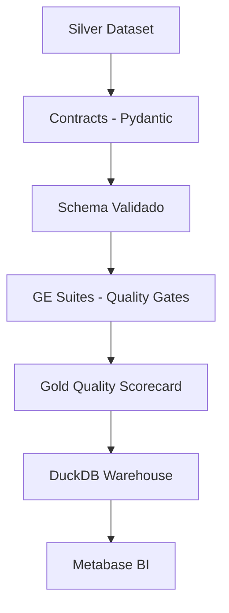
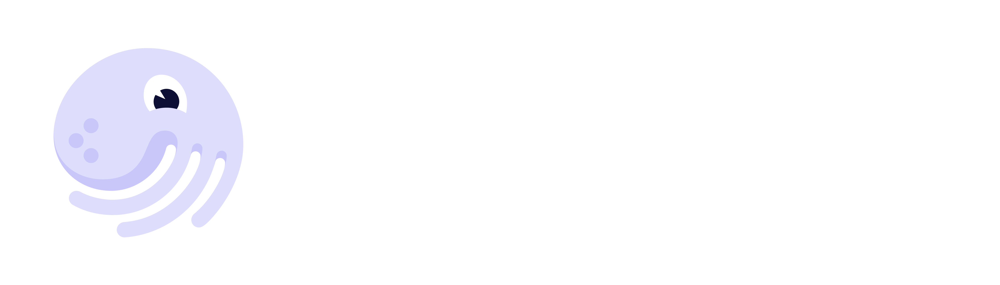

# 🌍 Air Quality Platform — Data Engineering Portfolio

<p align="center">
  <!-- Troque por um banner seu (recomendado) -->
  
</p>

<p align="center">
  <b>Plataforma de Engenharia de Dados para qualidade do ar com Arquitetura Medalhão (Bronze → Silver → Gold), Data Quality (Great Expectations) e BI (Metabase).</b>
</p>

> **Status:** Projeto em desenvolvimento (PoC). No momento, a ingestão na camada **Bronze** usa dados **mockados**; em seguida, será integrada uma API real (OpenAQ).

<p align="center">
  <!-- Badges (ajuste conforme seu repo/CI) -->
  
  
  
  
  
  
</p>

---

## 🧭 Sumário

- [✨ Visão Geral](#-visão-geral)
- [💎 Diferenciais Técnicos](#-diferenciais-técnicos)
- [🏗️ Arquitetura](#️-arquitetura)
  - [Arquitetura Medalhão](#-arquitetura-medalhão-bronze--silver--gold)
  - [Fluxo do Pipeline](#-fluxo-do-pipeline)
  - [Governança e Data Quality](#-governança-e-data-quality)
- [📌 Regras de Negócio](#-regras-de-negócio)
- [🧰 Stack & Documentação](#-stack--documentação)
- [📂 Estrutura do Projeto](#-estrutura-do-projeto)
- [🚀 Tutorial de Uso](#-tutorial-de-uso)
  - [Pré-requisitos](#-pré-requisitos)
  - [Clonar repositório](#-clonar-repositório)
  - [Instalar dependências](#-instalar-dependências)
  - [Variáveis de ambiente](#-variáveis-de-ambiente)
  - [Executar o pipeline](#-executar-o-pipeline)
  - [Subir UIs (Dagster + Metabase)](#-subir-uis-dagster--metabase)
- [🐳 Docker & Makefile](#-docker--makefile)
- [📥📤 Exemplos de Dados](#-exemplos-de-dados)
- [✅ Data Quality — Great Expectations](#-data-quality--great-expectations)
- [📊 Metabase & Observabilidade](#-metabase--observabilidade)
- [🎯 Valor de Negócio](#-valor-de-negócio)
- [🗺️ Roadmap](#️-roadmap)
- [🤝 Contribuição](#-contribuição)
- [📄 Licença](#-licença)

---

## ✨ Visão Geral

Este projeto demonstra uma plataforma de **Engenharia de Dados** com foco em:

- ✅ **Qualidade de dados** (quality gates e suites versionadas)
- 🧾 **Governança** (contratos, rastreabilidade e scorecards)
- ⚙️ **Reprodutibilidade** (Docker + Makefile)
- 📊 **Observabilidade** (dashboards no Metabase com métricas de DQ)
- ⚡ **Performance** (Parquet + DuckDB)

### 🧩 Contexto do problema de negócio

Organizações precisam monitorar a qualidade do ar por cidade para:

- 🏥 Saúde pública
- 📜 Compliance ambiental
- 🏭 Decisões operacionais (alertas, risco, planejamento)

**Desafio:** dados externos tendem a ser **inconsistentes** (nulos, duplicidade, unidades divergentes).

### 🎯 O que a plataforma resolve

- Coleta dados (OpenAQ ou mock) e os organiza em **Arquitetura Medalhão**
- Aplica **padronização e deduplicação** na Silver
- Implementa **Data Quality como código** com Great Expectations
- Publica **scorecards** e datasets prontos para BI na Gold
- Disponibiliza consultas via **DuckDB** e dashboards no **Metabase**

### 👥 Público-alvo

- Times de Dados (DE/AE/BI)
- Tech Leads / Arquitetos
- Stakeholders que precisam de indicadores confiáveis

---

## 💎 Diferenciais Técnicos

- 🧱 **Arquitetura Medalhão**: Bronze (raw) → Silver (confiável) → Gold (BI-ready)
- 🧾 **Contratos e tipagem**: validação explícita de schema (Pydantic)
- ✅ **Quality Gates**: expectations do GE versionadas + scorecards (auditáveis)
- 🔎 **Observabilidade**: views e métricas de qualidade no Metabase
- 🐳 **Ambiente reprodutível**: Docker/Compose + Makefile
- ⚡ **Engine analítica local**: DuckDB + Parquet para consultas rápidas

---

## 🏗️ Arquitetura

### 🟫⬜🟨 Arquitetura Medalhão (Bronze → Silver → Gold)

- 🟫 **Bronze**
  - Dados brutos da API (OpenAQ) ou mock
  - Persistência em **JSON**
  - Particionado por `dt` (dia)

- ⬜ **Silver**
  - Padronização e tipagem
  - Normalização de campos e timezone
  - Deduplicação por chave lógica
  - Persistência em **Parquet**

- 🟨 **Gold**
  - Datasets prontos para BI
  - Scorecards de Data Quality (por `dt`, dataset e expectation)
  - Views em DuckDB consumidas no Metabase

---

### 🔁 Fluxo do Pipeline



---

### 🧾 Governança e Data Quality



---

## 📌 Regras de Negócio

Regras aplicadas principalmente na Silver e validadas com GE:

- 🔒 `location_id`, `parameter`, `value` **não podem ser nulos**
- 📉 `value` **deve ser >= 0**
- 🧬 (`location_id`, `parameter`, `datetime`) **deve ser único** (evita duplicidade por sensor/parâmetro/instante)

**Impacto:** evita métricas infladas por duplicidade e garante consistência temporal/analítica.

---

## 🧰 Stack & Documentação

<p align="left">
  <a href="https://dagster.io/"></a>
  <a href="https://www.python.org/"></a>
  <a href="https://duckdb.org/"></a>
  <a href="https://greatexpectations.io/"></a>
  <a href="https://www.metabase.com/"></a>
  <a href="https://www.docker.com/"></a>
</p>

> 💡 Dica de portfólio: coloque também logos locais (PNG) em `docs/assets/logos/` para evitar links externos e deixar o README “perfeito” offline.

| Tecnologia | Papel no projeto | Documentação |
|---|---|---|
| 🐍 Python | transformações, contratos e utilitários | https://docs.python.org/3/ |
| 🧠 Dagster | orquestração (assets, jobs, schedules) | https://docs.dagster.io/ |
| 🦆 DuckDB | engine analítica e views locais | https://duckdb.org/docs/ |
| ✅ Great Expectations | validação e quality gates | https://docs.greatexpectations.io/ |
| 📊 Metabase | BI e dashboards | https://www.metabase.com/docs/latest/ |
| 🐳 Docker | empacotamento e execução | https://docs.docker.com/ |
| 🧩 Docker Compose | orquestração local de containers | https://docs.docker.com/compose/ |
| 🌐 OpenAQ API | fonte pública de dados de qualidade do ar | https://docs.openaq.org/api |

---

## 📂 Estrutura do Projeto

```text
air-quality-platform/
├── Dockerfile
├── Makefile
├── README.md
├── docker-compose.yml
├── main.py
├── orchestrator/
│   └── dagster_project/
│       ├── assets/
│       │   ├── bronze_assets.py
│       │   ├── silver_assets.py
│       │   ├── quality_assets.py
│       │   ├── gold_scorecard_assets.py
│       │   └── warehouse_refresh.py
│       ├── contracts/
│       │   └── silver_contracts.py
│       ├── gold/
│       │   └── scorecard_builder.py
│       ├── io/
│       │   ├── local_storage_client.py
│       │   └── storage_client.py
│       ├── quality/
│       │   ├── ge_setup.py
│       │   ├── ge_suites.py
│       │   └── ge_validation_definition.py
│       ├── warehouse/
│       │   └── duckdb_warehouse.py
│       ├── definitions.py
│       └── resources.py
├── data/
│   ├── bronze/
│   ├── silver/
│   ├── gold/
│   └── ge/
├── docs/
│   └── assets/
│       ├── hero-air-quality.png
│       ├── dagster-ui.png
│       └── metabase-dashboard.png
├── scripts/
│   ├── create_duckdb_tables.py
│   └── update_duckdb_views.py
├── pyproject.toml
└── uv.lock
```

Para ver o `tree` completo localmente:

```bash
tree .
```

---

## 🚀 Tutorial de Uso

### ✅ Pré-requisitos

- Python **3.12+**
- `uv` (ou pip)
- Docker + Docker Compose
- (Opcional) `make` (Linux/macOS/WSL)

---

### 📥 Clonar repositório

```bash
git clone https://github.com/vitoriarntrindade/air-quality-plataform-dagster-pipeline
cd air-quality-platform
```

---

### 🧪 Instalar dependências

#### Linux/macOS

```bash
python -m venv .venv
source .venv/bin/activate
uv sync
```

#### Windows (PowerShell)

```powershell
python -m venv .venv
.\.venv\Scripts\Activate.ps1
uv sync
```

---

### 🔐 Variáveis de ambiente

#### Linux/macOS

```bash
export BRONZE_SOURCE=openaq
export OPENAQ_API_KEY=SEU_TOKEN
export OPENAQ_PARAMETERS=pm25,pm10,no2,o3
export OPENAQ_LIMIT=500
export AIR_QUALITY_CITY="Sao Paulo"
export AIR_QUALITY_COUNTRY=BR
```

#### Windows (PowerShell)

```powershell
$env:BRONZE_SOURCE = "openaq"
$env:OPENAQ_API_KEY = "SEU_TOKEN"
$env:OPENAQ_PARAMETERS = "pm25,pm10,no2,o3"
$env:OPENAQ_LIMIT = "500"
$env:AIR_QUALITY_CITY = "Sao Paulo"
$env:AIR_QUALITY_COUNTRY = "BR"
```

---

### ▶️ Executar o pipeline

```bash
make job-daily DATE=2026-01-10
```

> Se você não tiver `make`, rode o job pela CLI do Dagster (ajuste para seu projeto):
```bash
dagster dev -f orchestrator/dagster_project/definitions.py
```

---

### 🧭 Subir UIs (Dagster + Metabase)

#### 1) Dagster UI

```bash
make dagster-ui
```

Acesse: **http://localhost:3001**

<p align="center">
  
</p>

#### 2) Metabase (Docker)

```bash
make up
```

Acesse: **http://localhost:3000**

<p align="center">
  
</p>

---

## 🐳 Docker & Makefile

### 🧰 Comandos disponíveis

| Comando | O que faz |
|---|---|
| `make venv` | cria ambiente virtual |
| `make install` | instala dependências (uv) |
| `make dagster-ui` | inicia Dagster UI (porta padrão 3001) |
| `make job-daily DATE=YYYY-MM-DD` | executa o job completo |
| `make asset-bronze DATE=YYYY-MM-DD` | materializa Bronze |
| `make asset-silver DATE=YYYY-MM-DD` | materializa Silver |
| `make asset-quality DATE=YYYY-MM-DD` | executa validações GE |
| `make asset-gold DATE=YYYY-MM-DD` | materializa Gold |
| `make asset-warehouse` | atualiza views no DuckDB |
| `make up` | sobe Metabase (Docker Compose) |
| `make down` | para Metabase |
| `make build` | build do container (se aplicável) |
| `make logs` | exibe logs do Metabase |
| `make clean-data` | remove dados gerados |
| `make clean-ge` | remove outputs do GE |

💡 **Windows:** se não tiver `make`, use **WSL** ou execute os comandos equivalentes (Docker Compose / Dagster CLI).

---

## 🧩 Scripts auxiliares (opcional)

Os scripts em `scripts/` são atalhos para tarefas pontuais e **não são obrigatórios** para rodar o projeto.

- `scripts/create_duckdb_tables.py` — cria tabelas no DuckDB (uso manual, se quiser materializar dados em tabelas)
- `scripts/update_duckdb_views.py` — atualiza views no DuckDB (equivalente ao asset `warehouse_duckdb_refresh`)

---

## 📥📤 Exemplos de Dados

### 🟫 Bronze (JSON bruto)

```json
{
  "meta": {
    "source": "openaq",
    "dt": "2026-01-10",
    "generated_at_utc": "2026-01-10T12:00:00+00:00"
  },
  "results": [
    {
      "locationId": 123,
      "city": "Sao Paulo",
      "country": "BR",
      "parameter": "pm25",
      "value": 12.3,
      "unit": "µg/m³",
      "datetime": "2026-01-10T12:00:00+00:00"
    }
  ]
}
```

### ⬜ Silver (Parquet normalizado)

```text
location_id | city      | country | parameter | value | unit  | datetime                  | dt
123         | Sao Paulo | BR      | pm25      | 12.3  | µg/m³ | 2026-01-10T12:00:00+00:00 | 2026-01-10
```

### 🟨 Gold (Scorecard de Data Quality)

```text
dt         | dataset             | expectation_type                      | severity | success | unexpected_count
2026-01-10 | silver.measurements | expect_column_values_to_not_be_null   | medium   | true    | 0
```

---

## ✅ Data Quality — Great Expectations

Suites configuradas em:
- `orchestrator/dagster_project/quality/ge_suites.py`

### 📋 Expectations (Quality Gates)

- ✅ `expect_column_values_to_not_be_null` em `location_id`
- ✅ `expect_column_values_to_not_be_null` em `parameter`
- ✅ `expect_column_values_to_not_be_null` em `value`
- ✅ `expect_column_values_to_be_between` em `value` (min=0)
- ✅ `expect_compound_columns_to_be_unique` em (`location_id`, `parameter`, `datetime`)

### 🧠 O que é validado

- Campos obrigatórios presentes
- Valores não-negativos
- Unicidade por sensor+parâmetro+timestamp (evita duplicidade)

### 🚨 O que acontece quando falha?

- O asset de qualidade falha e **bloqueia downstream**
- Gold e Warehouse **não são atualizados** com dados inválidos

### 🔎 Onde ver resultados

- Resultado detalhado (JSON):
  - `data/ge/results/.../validation_result.json`
- Scorecard consolidado (Gold):
  - `data/gold/scorecards/data_quality/.../scorecard.parquet`
- Metabase (views DuckDB):
  - `gold_data_quality_scorecard`
  - `ge_validation_results`

---

## 📊 Metabase & Observabilidade

O Metabase consome views do DuckDB para:

- 📈 % de sucesso por expectation
- 🧯 Top falhas por coluna/parâmetro
- 🕒 Tendência de inconsistências por dia
- 🧾 Auditoria por execução (dataset → dt → expectation → resultado)

Views recomendadas:
- `gold_data_quality_scorecard` — scorecards consolidados
- `ge_validation_results` — detalhamento completo das validações

---

## 🎯 Valor de Negócio

- 🛡️ **Reduz riscos**: bloqueia dado ruim antes do BI
- ✅ **Aumenta confiança**: indicadores sustentados por quality gates
- 🧾 **Facilita auditoria**: scorecards rastreáveis por execução
- ⚡ **Acelera insights**: Parquet + DuckDB + views para consumo rápido
- 📊 **Observabilidade real**: qualidade visível por dashboard e tendência

---

## 🗺️ ToDo

- [ ] Adicionar **testes unitários** para contratos (Pydantic) e transformações
- [ ] Incluir **validação de unidades** (normalização µg/m³, ppm etc.)
- [ ] Publicar **data dictionary** (campos, tipos, semântica)
- [ ] Implementar **alertas** (Slack/Email) quando quality gates falharem
- [ ] Criar dashboards extras (heatmap por cidade, por parâmetro)

---

## 🤝 Contribuição

Contribuições são bem-vindas!  
Sugestões:

- Abrir issue com bug/ideia
- PR com melhoria (docs, código, qualidade, dashboards)

Padrão recomendado:
- Branch: `feat/...`, `fix/...`, `docs/...`
- Commits curtos e semânticos
